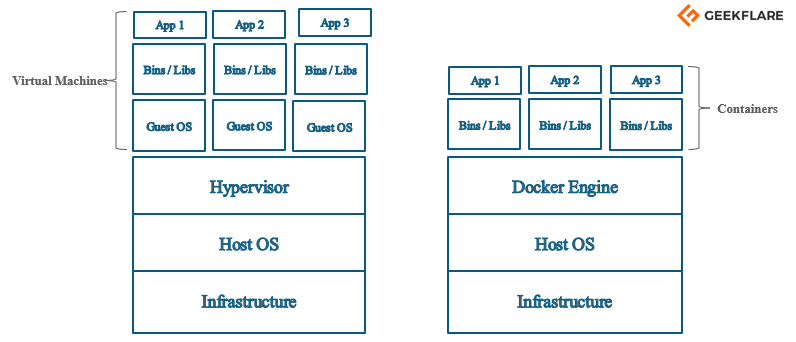

 

  <h1 align="center">Inception</h1>

  

    Creating a docker-based WordPress LEMP stack using docker-compose on Alpine Linux or Debian Buster.
     
     
  

## Table Of Contents

* [Definitions](#definitions)

## Definitions

### Docker?
 
Docker is a tool that uses containers to make creation, deployment, and running of application a lot easier. It binds application and its dependencies inside a container.

### Docker-compose?

Docker Compose is a tool that was developed to help define and share multi-container applications. With Compose, we can create a YAML file to define the services and with a single command, can spin everything up or tear it all down.

### Docker VS Docker-compose

The key difference between docker run versus docker-compose is that docker run is entirely command line based, while docker-compose reads configuration data from a YAML file. 

The second major difference is that docker run can only start one container at a time, while docker-compose will configure and run multiple.

### Docker VS Virtual Machine

As you can see each virtual machine has its guest operating system above the host operating system, which makes virtual machines heavy. While on the other hand, Docker containers share the host operating system, and that is why they are lightweight. 

Here is a table which concludes on a virtual machine and Docker container differences.

<table>
    <tr>
      <th>Virtual Machine</th>
      <th>Docker Container</th>
    </tr>
    <tr>
      <td>Hardware-level process isolation</td>
      <td>OS level process isolation</td>
    </tr>
    <tr>
      <td>Each VM has a separate OS</td>
      <td>Each container can share OS</td>
    </tr>
    <tr>
      <td>Boots in minutes</td>
      <td>Boots in seconds</td>
    </tr>
    <tr>
      <td>VMs are of few GBs</td>
      <td>Containers are lightweight (KBs/MBs)</td>
    </tr>
    <tr>
      <td>Ready-made VMs are difficult to find</td>
      <td>Pre-built docker containers are easily available</td>
    </tr>
    <tr>
      <td>VMs can move to new host easily</td>
      <td>Containers are destroyed and re-created rather than moving</td>
    </tr>
    <tr>
      <td>Creating VM takes a relatively longer time</td>
      <td>Containers can be created in seconds</td>
    </tr>
    <tr>
      <td>More resource usage</td>
      <td>Less resource usage</td>
    </tr>
</table>

    
 🔎 Resources 

    <h4>For Read</h4>
    <a href="https://aws.amazon.com/docker/" > - What is Docker?</a>
     
    <a href=https://docs.docker.com/compose/" > - What is Docker-compose?</a>
     
    <a href="https://geekflare.com/docker-vs-virtual-machine/" > - Docker-vs-virtual-machine?</a>
     
    <a href="https://openclassrooms.com/en/courses/2035766-optimisez-votre-deploiement-en-creant-des-conteneurs-avec-docker" > - Optimize your deployment by building containers with Docker.</a>
     
    <a href="https://cloud.google.com/architecture/best-practices-for-building-containers" > - Best practices for building containers</a>
     
    <h4>For Watch</h4>
    <a href="https://www.youtube.com/watch?v=rOTqprHv1YE" > - What Is Docker? | What Is Docker And How It Works?</a>
     
    <a href="https://www.youtube.com/watch?v=pTFZFxd4hOI" > - Docker Tutorial for Beginners</a>
     
    <a href="https://www.youtube.com/watch?v=HG6yIjZapSA" > - Docker Compose Tutorial</a>
     

